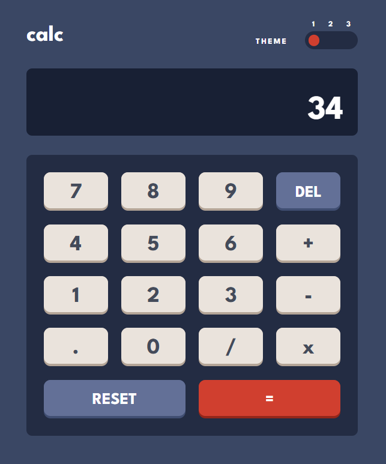
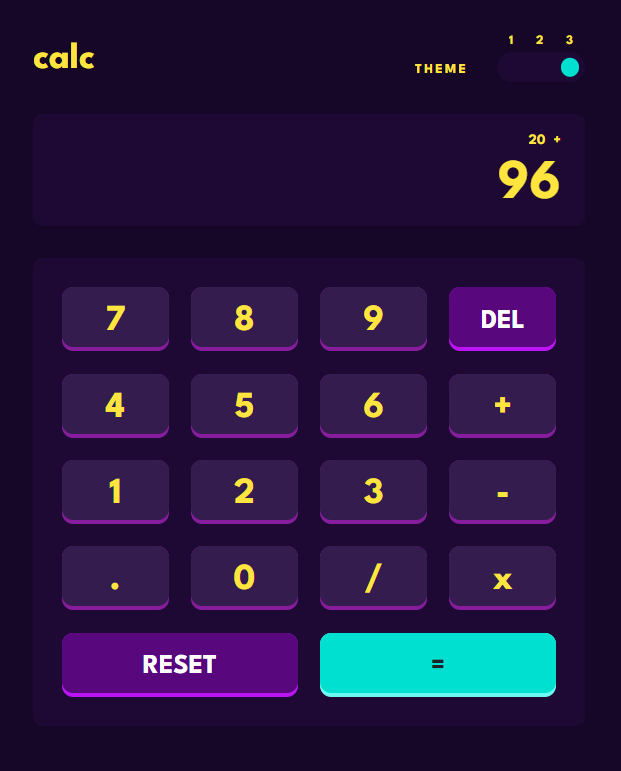

[TYPESCRIPT__BADGE]: https://img.shields.io/badge/typescript-D4FAFF?style=for-the-badge&logo=typescript
[REACT__BADGE]: https://img.shields.io/badge/React-005CFE?style=for-the-badge&logo=react
[VITEST__BADGE]: https://img.shields.io/badge/-Vitest-252529?style=for-the-badge&logo=vitest&logoColor=FCC72B
[CONTEXT_API__BADGE]: https://img.shields.io/badge/Context--Api-000000?style=for-the-badge&logo=react
[STYLED_COMPONENTS__BADGE]: https://img.shields.io/badge/styled--components-DB7093?style=for-the-badge&logo=styled-components&logoColor=white
[PROJECT__BADGE]: https://img.shields.io/badge/📱Acessar_o_projeto-000?style=for-the-badge&logo=project
[PROJECT__URL]: https://calculadora-com-temas-web.vercel.app/

<h1 align="center" style="font-weight: bold;">Calculadora com temas</h1>

![react][REACT__BADGE]
![context-api][CONTEXT_API__BADGE]
![typescript][TYPESCRIPT__BADGE]
![styled-components][STYLED_COMPONENTS__BADGE]
![vitest][VITEST__BADGE]

    <a href="#sobre">Sobre</a> • 
    <a href="#tecnologias">Tecnologias utilizadas</a>

    
    
    

<h2 id="sobre">📌 Sobre</h2>

Este projeto consiste no desenvolvimento de uma calculadora básica que realiza operações matemáticas e possui um sistema para mudança de temas. Esta aplicação foi desenvolvida utilizando as técnicas de "mobile-first" e responsividade.

Para implementar as funcionalidades da calculadora, foi utilizada a técnica de TDD(Test-Driven Development), criando primeiramente os testes e depois implementando o código para que os testes fossem concluídos com sucesso.

Quanto à mudança de temas, em toda eventual troca de tema, o valor do tema é armazenado temporariamente em um estado, e esse valor é persistido na localStorage, para que, ao recarregar a página, o último tema selecionado seja aplicado.

O template desse projeto pode ser encontrado em: [template-calculator-app](https://www.frontendmentor.io/challenges/calculator-app-9lteq5N29)

[![project][PROJECT__BADGE]][PROJECT__URL]

<h2 id="tecnologias">🛠️ Tecnologias Utilizadas</h2>

- **TypeScript** - Linguagem de programação baseada em JavaScript, com a adição de tipagem estática.

- **React** - Biblioteca front-end para construir interfaces visuais com JavaScript.

- **Styled Components** - Biblioteca CSS-in-JS para estilizar e gerenciar os temas da aplicação.

- **Vitest** - Framework de testes nativo do Vite, usado para garantir que as funcionalidades da aplicação estejam funcionando corretamente.
